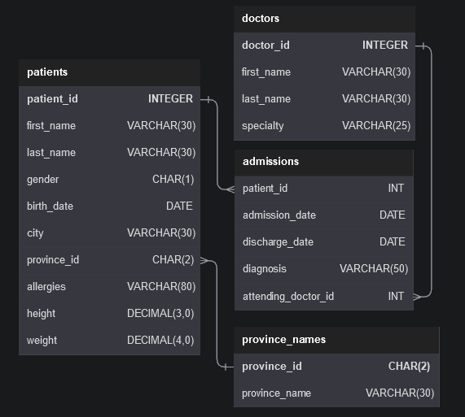

# Hospital

This repository is for the Hospital database. Below is the schema of the database, the questions according to difficulty levels (easy, intermediate, hard) and my own answer to each question.

### Database schema



## Questions

### <u>Easy:</u>

1. Show first name, last name, and gender of patients whose gender is 'M'

```
SELECT
	first_name,
    last_name,
    gender
FROM patients
WHERE gender is "M";
```
