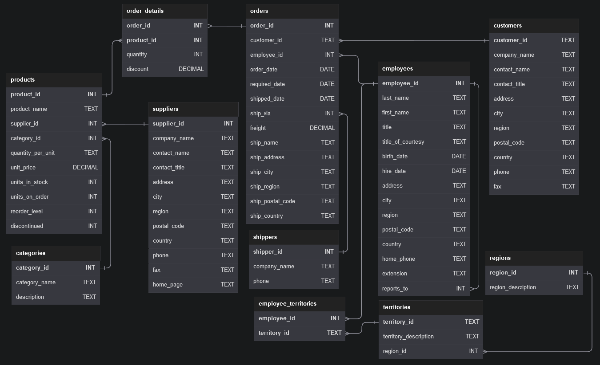

# Northwind

This repository is for the Northwind database. Below is the schema of the database, the questions according to difficulty levels (easy, intermediate, hard) and my own answer to each question.

## Database schema



## Questions

### <u>Hard:</u>

1 Show the employee's first_name and last_name, a "num_orders" column with a count of the orders taken, and a column called "Shipped" that displays "On Time" if the order shipped_date is less or equal to the required_date, "Late" if the order shipped late.

Order by employee last_name, then by first_name, and then descending by number of orders.

```
SELECT
  e.first_name,
  e.last_name,
  COUNT(o.order_date) AS num_orders,
  (CASE
    WHEN o.shipped_date <= o.required_date THEN 'On Time'
    ELSE 'Late'
    END
  ) AS shipped
FROM employees e
JOIN orders o ON e.employee_id = o.employee_id
GROUP BY first_name, last_name, shipped
ORDER BY e.last_name, e.first_name, num_orders DESC;
```

2 Show how much money the company lost due to giving discounts each year, order the years from most recent to least recent. Round to 2 decimal places

```
SELECT
  YEAR(o.order_date) AS order_year,
  ROUND(SUM(od.quantity * p.unit_price * od.discount), 2) AS total_discount FROM order_details od
JOIN orders o ON od.order_id = o.order_id
JOIN products p ON od.product_id = p.product_id
GROUP BY YEAR(order_date)
ORDER BY order_year DESC;
```

### <u>Medium:</u>

1 Show the ProductName, CompanyName, CategoryName from the products, suppliers, and categories table

```
SELECT
  p.product_name,
  s.company_name,
  c.category_name
FROM categories c
JOIN products p ON c.category_id = p.category_id
JOIN suppliers s ON p.supplier_id = s.supplier_id;
```

2 Show the category_name and the average product unit price for each category rounded to 2 decimal places.

```
SELECT
  c.category_name AS category,
  ROUND(AVG(p.unit_price), 2) AS average_price
FROM categories AS c
JOIN products AS p on c.category_id = p.category_id
GROUP BY category_name;
```

3 Show the city, company_name, contact_name from the customers and suppliers table merged together.
Create a column which contains 'customers' or 'suppliers' depending on the table it came from.

```
SELECT city, company_name, contact_name, 'customers' AS relationship FROM customers
UNION
SELECT city, company_name, contact_name, 'suppliers' FROM suppliers;
```

### <u>Easy:</u>

1 Show the category_name and description from the categories table sorted by category_name.

```
SELECT
  category_name,
  description
FROM categories
ORDER BY category_name;
```

2 Show all the contact_name, address, city of all customers which are not from 'Germany', 'Mexico', 'Spain'

```
SELECT
  contact_name,
  address,
  city
FROM customers
WHERE Country NOT IN ('Germany','Mexico', 'Spain');
```

3 Show order_date, shipped_date, customer_id, Freight of all orders placed on 2018 Feb 26

```
SELECT
  order_date,
  shipped_date,
  customer_id,
  freight
FROM orders
WHERE order_date = '2018-02-26';
```

4 Show the employee_id, order_id, customer_id, required_date, shipped_date from all orders shipped later than the required date

```
SELECT
	employee_id,
    order_id,
    customer_id,
    required_date,
    shipped_date
FROM orders
WHERE shipped_date > required_date;
```

5 Show all the even numbered Order_id from the orders table

```
SELECT order_id
FROM orders
WHERE mod(order_id,2) = 0;
```

6 Show the city, company_name, contact_name of all customers from cities which contains the letter 'L' in the city name, sorted by contact_name

```
SELECT
  city,
  company_name,
  contact_name
FROM customers
WHERE city LIKE '%L%'
ORDER BY contact_name;
```

7 Show the company_name, contact_name, fax number of all customers that has a fax number. (not null)

```
SELECT
  company_name,
  contact_name,
  fax
FROM customers
WHERE fax NOT NULL;
```

8 Show the first_name, last_name. hire_date of the most recently hired employee.

```
SELECT
  first_name,
  last_name,
  MAX(hire_date) AS hire_date
FROM employees;
```

9 Show the average unit price rounded to 2 decimal places, the total units in stock, total discontinued products from the products table.

```
SELECT
  ROUND(AVG(unit_price), 2) AS average_unit_price,
  SUM(units_in_stock) AS total_units_in_stock,
  SUM(discontinued) AS discontinued_products
FROM products;
```
